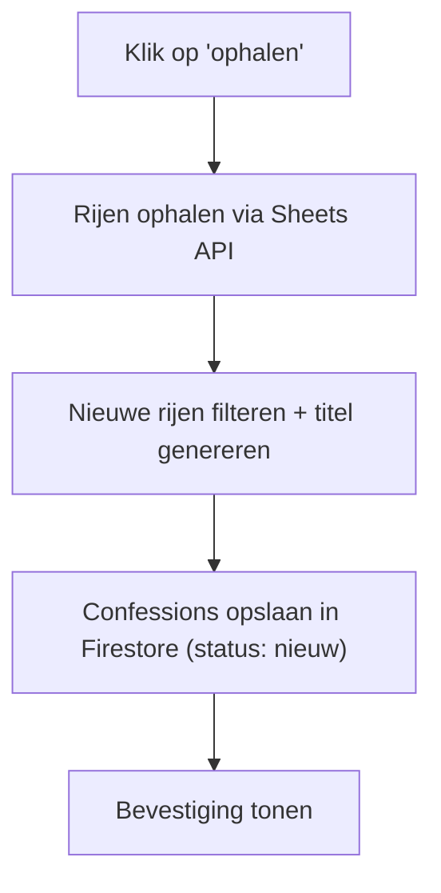
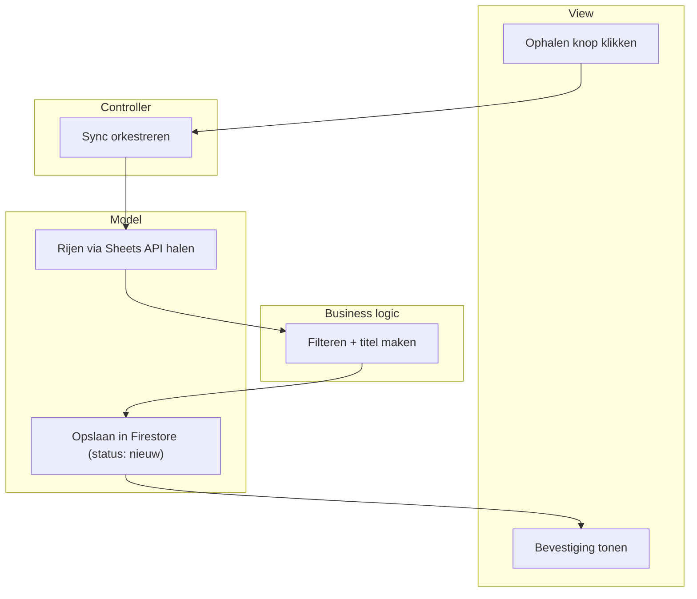

# KU Leuven Confessions — moderatie- en publicatietool

Een tool om de admin van de Instagram-pagina "KU Leuven Confessions" te helpen bij het filteren, categoriseren en publiceren van binnenkomende confessions.

**Architectuur:** een Rust API-server (backend) + een React-gebruikersinterface (frontend), die met elkaar praten via JSON-verzoeken. Zelf gehost op een oude Intel MacBook.

Dit document bevat het volledige High Level Design (HLD), opgebouwd volgens de **Application Structure Analysis (ASA)**-methodiek ([e-learning.educom.nu](https://e-learning.educom.nu/essentials/decomposition/intro)).

**Status:** ontwerp (stap 1 t/m 6) afgerond — implementatie gestart.

---

## Stap 1 — Probleemanalyse

**Probleem:** de admin krijgt een groot, ongestructureerd volume confessions binnen via een Google Form. Filteren, categoriseren en manueel in de Instagram-template plaatsen is trager en foutgevoeliger dan nodig.

**Doel:** confessions centraal verzamelen, laten taggen/categoriseren (manueel en later automatisch), filterbaar maken, en de admin volledige controle geven over categorieën/tags/template zonder dat hij moet kunnen programmeren.

**Stakeholders**
- **Admin** — enige primaire gebruiker
- **Ontwikkelaar** (ik) — bouwt en onderhoudt het systeem, tweede gebruiker
- *(indirect)* inzenders via het Google Form — leveren ruwe data, geen interactie met de tool

**Randvoorwaarden (niet-functionele eisen)**
- Eén à twee gebruikers, geen complexe rolverdeling nodig
- **Backend:** Rust (axum), als webserver zelf gehost op een oude Intel MacBook, bereikbaar via een gratis Cloudflare Tunnel
- **Frontend:** React, opgebouwd volgens **Atomic Design** (atomen → moleculen → organismen → templates → pagina's), gescaffold met de `atomic-bomb`-tool
- Eén gedeeld wachtwoord ter beveiliging (de app is publiek bereikbaar via het internet)
- **Databron:** de Google Sheet gekoppeld aan het Form, gelezen via de Google Sheets API met een read-only service-account
- **Opslag:** Firebase — **Firestore** voor de tekstuele data, **Cloud Storage for Firebase** voor afbeeldingen. Firebase bewaart data al redundant, dus is er geen apart backup-proces meer nodig
- Volledig **configureerbaar**: tags, categorieën en template-vormgeving door de admin zelf aanpasbaar, zonder code te wijzigen
- **Uitbreidbaar**: latere automatische classificatie (LLM) en automatische Instagram-statistieken (Meta Graph API) moeten erbij kunnen zonder herbouw

---

## Stap 2 — Functionele decompositie (processen)

1. **Nieuwe confessions synchroniseren** — ophalen via de Sheets API, dedupliceren op `form_response_id`, automatische titel genereren
2. **Confessions bekijken & filteren** — op status, tag, lengte, sortering (o.a. op likes)
3. **Confession taggen/categoriseren**
4. **Tag/categorie beheren** — aanmaken, hernoemen, kleur geven
5. **Confession verwijderen** — content wissen, tombstone-record behouden (zie onder)
6. **Confession markeren als 'gebruikt'** — volgnummer toekennen
7. **Confessie-afbeelding(en) + caption genereren** — template invullen, splitsen over meerdere afbeeldingen indien nodig, caption voorstellen
8. **Instellingen/configuratie beheren** — template, tekstlimieten, koppelingen, wachtwoord
9. **Post-statistieken bijwerken** — like-/reactie-aantal koppelen (manueel nu, later automatisch via Meta Graph API)


---

## Stap 3 — ERD (datamodel)


**Belangrijke regels**
- `status` heeft drie waarden: `nieuw`, `gebruikt`, `verwijderd`.
- **Tombstone-pattern**: "verwijderen" wist de inhoud (tekst, privébericht, foto's, tags) maar behoudt het rijtje zelf (`id` + `form_response_id` + `status = verwijderd`). Dit voorkomt dat een verwijderde confession bij de volgende sync terug binnenkomt als "nieuw".
- `admin_message` (het privébericht aan de admin) mag **nooit** in de gegenereerde afbeelding of caption terechtkomen.
- `Tag` is generiek en dekt categorie, type én kwaliteit (bv. "meme", "zoekertje", "all stars").
- **Firestore-vertaling** (logisch model blijft hetzelfde, opslag verandert): `Confession` wordt een document in een `confessions`-collectie met een `tagIds`-array erin (geen apart join-document nodig); `Attachment` en `Slide` worden subcollecties onder elk confession-document; `Tag` en `Setting` blijven eigen top-level collecties.

---

## Stap 4 — Schermschetsen

**Overzicht** — hoofdscherm: zoekbalk, sync-knop, filters (status/tag/sortering), lijst van confessions met titel, preview, tags en status.

**Confessie-detail** — volledige tekst, apart gemarkeerd privébericht aan de admin, tags toewijzen, acties (verwijderen / markeren als gebruikt / genereren). Bij gepubliceerde confessions: extra blok met Instagram-link en statistieken. Na genereren: voorbeeld van de afbeelding(en) + voorgestelde caption, met downloadknoppen.

**Instellingen** — drie tabbladen: *Tags & categorieën*, *Template* (lettertype, kleuren, tekstlimiet per afbeelding), *Algemeen* (API-koppeling, backup-map, wachtwoord, startnummer).

---

## Stap 5 — Flowcharts (happy path per proces)

Voorbeeld, proces "nieuwe confessions synchroniseren":



| Proces | Happy path |
|---|---|
| Bekijken & filteren | Scherm openen → filters toepassen → lijst tonen |
| Taggen | Confession openen → tag kiezen → koppeling opslaan |
| Tag beheren | Instellingen openen → naam/kleur invoeren → tag opslaan |
| Verwijderen | 'Verwijderen' klikken → inhoud wissen, tombstone behouden → confession verdwijnt uit lijst |
| Markeren als gebruikt | Knop klikken → volgnummer toekennen → status bijwerken |
| Afbeelding(en) + caption genereren | 'Genereer' klikken → template invullen, eventueel splitsen → caption opstellen → resultaat tonen |
| Instellingen beheren | Parameter aanpassen → opslaan → direct van toepassing |
| Statistieken bijwerken | Aantal invullen → opslaan met tijdstip |

---

## Stap 6 — ASD (Application Structure Diagram)

4 lagen: **Actor/View** (React-frontend) → **Controller** (Rust route-handler) → **Business logic** (regels) → **Model** (Sheets API / Firestore / Cloud Storage).



| Proces | View | Controller | Business logic | Model |
|---|---|---|---|---|
| Synchroniseren | Ophalen klikken | Sync orkestreren | Filteren + titel maken | Sheets API lezen + Firestore schrijven |
| Bekijken & filteren | Filters instellen | Verzoek verwerken | Filters/sortering toepassen | Confessions + tags ophalen |
| Taggen | Tag kiezen | Toewijzing verwerken | Check op duplicaat | `tagIds` bijwerken |
| Tag beheren | Nieuwe tag invoeren | Aanmaak verwerken | Naam-validatie | Tag-document opslaan |
| Verwijderen | 'Verwijderen' klikken | Verzoek verwerken | Inhoud wissen, tombstone behouden | Confession-document bijwerken |
| Markeren als gebruikt | Knop klikken | Verzoek verwerken | Volgend nummer bepalen | Confession bijwerken |
| Afbeelding(en) + caption genereren | 'Genereer' klikken | Verzoek verwerken | Tekst verdelen, caption opstellen | Template ophalen + Cloud Storage opslaan |
| Instellingen beheren | Parameter aanpassen | Wijziging verwerken | Waarde valideren | Setting bijwerken |
| Statistieken bijwerken | Aantal invullen | Update verwerken | *(later: via Meta API)* | Confession bijwerken |

---

## Projectstructuur

```
kuleuven-confessions-tool/
├── README.md
├── .gitignore
├── secrets/                     # NOOIT in git — service-account.json
├── backend/                     # Rust API-server
│   ├── Cargo.toml
│   ├── templates/
│   │   └── confession-template.svg   # SVG-sjabloon voor confession-afbeeldingen
│   └── src/
│       ├── main.rs              # opstarten server + routes registreren
│       ├── config.rs            # instellingen/omgevingsvariabelen inladen
│       ├── routes/              # Controller-laag: 1 HTTP-handler per resource
│       │   ├── mod.rs
│       │   ├── confessions.rs
│       │   ├── tags.rs
│       │   ├── settings.rs
│       │   └── sync.rs
│       ├── business/            # Business logic-laag: regels & validatie
│       │   ├── mod.rs
│       │   ├── dedupe.rs        # tombstone-check bij sync
│       │   ├── title.rs         # automatische titel genereren
│       │   ├── template.rs      # tekst verdelen over slides + caption opstellen
│       │   └── numbering.rs     # volgnummer toekennen
│       └── model/               # Model-laag: lezen/schrijven van data
│           ├── mod.rs
│           ├── sheets.rs        # Google Sheets API (nieuwe confessions ophalen)
│           ├── firestore.rs     # Firestore (confessions/tags/settings CRUD)
│           ├── storage.rs       # Cloud Storage (afbeeldingen op-/downloaden)
│           └── image_render.rs  # resvg: SVG-template → PNG
└── frontend/                    # React, opgebouwd met Atomic Design
    ├── package.json
    ├── .atomic-bomb             # config voor de atomic-bomb generator
    └── src/
        ├── components/
        │   ├── atoms/           # bv. Button, Label, Input
        │   ├── molecules/       # bv. TagChip, SearchBar
        │   ├── organisms/       # bv. ConfessionCard, FilterBar
        │   ├── templates/       # paginalay-outs zonder echte data
        │   └── pages/           # Overzicht, Detail, Instellingen
        └── api/
            └── confessions.ts   # fetch-aanroepen naar de Rust-backend
```

---

## Tech stack

- **Backend:** Rust, axum (webserver)
- **Frontend:** React + TypeScript (Vite), Atomic Design via `atomic-bomb`
- **Databank:** Firestore (Firebase, gratis Spark-plan)
- **Bestandsopslag:** Cloud Storage for Firebase (afbeeldingen)
- **Externe data:** Google Sheets API, service-account met `spreadsheets.readonly`-scope
- **Afbeeldingen genereren:** SVG-template + `resvg` crate (rasterizen naar PNG)
- **Hosting:** oude Intel MacBook + Cloudflare Tunnel

## Beveiliging

- Eén gedeeld wachtwoord voor toegang tot de webapp
- Service-account sleutel (`.json`) **nooit** in git committen — zie `.gitignore`
- Service-account heeft enkel leesrechten, geen schrijf/verwijderrechten op de Sheet
- Het Sheet-ID zelf is geen geheim en mag gedeeld worden; de sleutel (`private_key`) wél altijd geheim houden

## Volgende stappen

1. Sheet-ID ontvangen + service-account viewer-toegang bevestigen
2. Testverbinding met de Sheets API (Rust-equivalent van de eerdere Forms-test)
3. Firebase-project aanmaken, Firestore + Cloud Storage inschakelen (Spark-plan)
4. Frontend scaffolden met Vite + React, eerste atomen genereren met `atomic-bomb`
5. Eerste end-to-end pad: confession ophalen → in Firestore opslaan → tonen in de React-lijst