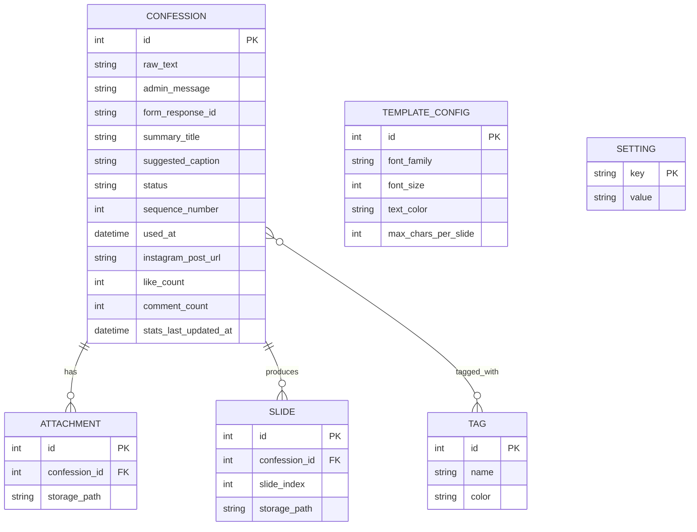
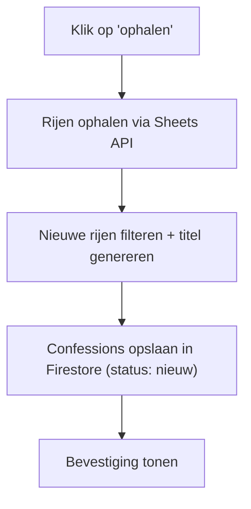
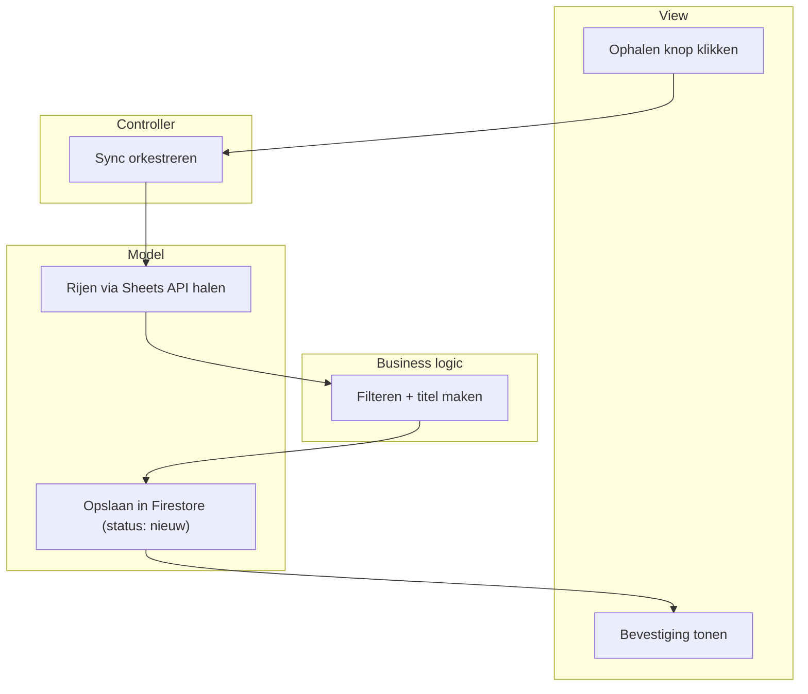

# KU Leuven Confessions — moderatie- en publicatietool

Een tool om de admin van de Instagram-pagina "KU Leuven Confessions" te helpen bij het filteren, categoriseren en publiceren van binnenkomende confessions.

**Architectuur:** een Rust API-server (backend, op Cloud Run) + een React-gebruikersinterface (frontend, op Firebase Hosting, opgebouwd volgens Atomic Design), die met elkaar praten via JSON-verzoeken. Data en bestanden leven in Firebase.

**Status:** ontwerp afgerond, implementatie gestart.

---

## Probleemanalyse

**Probleem:** de admin krijgt een groot, ongestructureerd volume confessions binnen via een Google Form. Filteren, categoriseren en manueel in de Instagram-template plaatsen is trager en foutgevoeliger dan nodig.

**Doel:** confessions centraal verzamelen, laten taggen/categoriseren (manueel en later automatisch), filterbaar maken, en de admin volledige controle geven over categorieën/tags/template zonder dat hij moet kunnen programmeren.

**Stakeholders**
- **Admin** — enige primaire gebruiker
- **Ontwikkelaar** — bouwt en onderhoudt het systeem, tweede gebruiker
- *(indirect)* inzenders via het Google Form — leveren ruwe data, geen interactie met de tool

**Randvoorwaarden (niet-functionele eisen)**
- Eén à twee gebruikers, geen complexe rolverdeling nodig
- **Backend:** Rust (axum), als container gehost op **Cloud Run** (serverless, schaalt naar nul bij geen gebruik)
- **Frontend:** React, opgebouwd volgens **Atomic Design** (atomen → moleculen → organismen → templates → pagina's), gescaffold met de `atomic-bomb`-tool, statisch gehost via **Firebase Hosting**
- Eén gedeeld wachtwoord ter beveiliging (de app is publiek bereikbaar via het internet)
- **Databron:** de Google Sheet gekoppeld aan het Form, gelezen via de Google Sheets API met een read-only service-account
- **Opslag tekstdata:** Firestore (Firebase)
- **Opslag afbeeldingen:** Cloud Storage for Firebase
- **Opruimbeleid afbeeldingen:** een confessie-afbeelding wordt een instelbaar aantal dagen na publicatie automatisch verwijderd — de Instagram-post zelf blijft het permanente archief, wij hoeven geen eigen kopie voor altijd te bewaren
- Volledig **configureerbaar**: tags, categorieën, template-vormgeving en opruimtermijn door de admin zelf aanpasbaar, zonder code te wijzigen
- **Uitbreidbaar**: latere automatische classificatie (LLM) en automatische Instagram-statistieken (Meta Graph API) moeten erbij kunnen zonder herbouw

---

## Kostenbeheer

Cloud Run en Cloud Storage for Firebase vereisen een betaalplan (Blaze) met een gekoppelde kaart, ook al blijft het verwachte verbruik ruim binnen het gratis quotum. Om verrassingen uit te sluiten:

- **Budget-alert** ingesteld op een laag bedrag (bv. €2), als vroege waarschuwing.
- **Automatische killswitch**: een budget-overschrijding stuurt een bericht naar een Pub/Sub-topic, dat een klein functietje activeert dat de betaalkoppeling van het project loskoppelt. Geen koppeling = onmogelijk om nog kosten te maken. Dit zet alle diensten in het project stil (ook de gratis onderdelen) — voor dit project een aanvaardbare prijs voor financiële zekerheid.
- Realistisch verbruik (1-2 gebruikers, occasioneel) blijft ordes van grootte onder het gratis quotum van Cloud Run (2 miljoen verzoeken/maand, 180.000 vCPU-seconden/maand). Het reële risico is een bug die ongemerkt continu blijft draaien — daarvoor dient de killswitch.
- De killswitch wordt opgezet **voor** de overstap naar het Blaze-plan, niet erna.

---

## Functionele decompositie (processen)

1. **Nieuwe confessions synchroniseren** — ophalen via de Sheets API, dedupliceren op `form_response_id`, automatische titel genereren
2. **Confessions bekijken & filteren** — op status, tag, lengte, sortering (o.a. op likes). Verwijderde confessions worden **standaard niet getoond**; een apart filter ("Prullenmand") laat ze tijdelijk zien
3. **Confession taggen/categoriseren**
4. **Tag/categorie beheren** — aanmaken, hernoemen, kleur geven
5. **Confession verwijderen** — content wissen, tombstone-record behouden, verdwijnt uit de standaardlijst (zie ERD-regels)
6. **Confession markeren als 'gebruikt'** — volgnummer toekennen
7. **Confessie-afbeelding(en) + caption genereren** — template invullen, tekst verdelen over meerdere afbeeldingen **met behoud van de originele alinea-structuur** (een witregel in de tekst is een natuurlijk splitspunt, geen botte afkap op tekenlimiet), caption voorstellen
8. **Instellingen/configuratie beheren** — template, tekstlimieten, opruimtermijn afbeeldingen, koppelingen, wachtwoord
9. **Post-statistieken bijwerken** — like-/reactie-aantal koppelen (manueel nu, later automatisch via Meta Graph API)

---

## Datamodel (ERD)



**Belangrijke regels**
- `status` heeft drie waarden: `nieuw`, `gebruikt`, `verwijderd`.
- **Tombstone-pattern**: "verwijderen" wist de inhoud (tekst, privébericht, foto's, tags) maar behoudt het rijtje zelf (`id` + `form_response_id` + `status = verwijderd`). Dit voorkomt dat een verwijderde confession bij de volgende sync terug binnenkomt als "nieuw" — en omdat het Overzicht standaard op status filtert, valt hij ook gewoon uit de normale lijst.
- `admin_message` (het privébericht aan de admin) mag **nooit** in de gegenereerde afbeelding of caption terechtkomen.
- `Tag` is generiek en dekt categorie, type én kwaliteit (bv. "meme", "zoekertje", "all stars").
- **Firestore-vertaling**: `Confession` wordt een document in een `confessions`-collectie met een `tagIds`-array erin; `Attachment` en `Slide` worden subcollecties met enkel een verwijzing (`storage_path`) naar het werkelijke bestand in Cloud Storage.

---

## Schermschetsen

**Overzicht** — hoofdscherm: zoekbalk, sync-knop, filters (status/tag/sortering, incl. "Prullenmand"-filter voor verwijderde confessions), lijst van confessions met titel, preview, tags en status.

**Confessie-detail** — volledige tekst, apart gemarkeerd privébericht aan de admin, tags toewijzen, acties (verwijderen / markeren als gebruikt / genereren). Bij gepubliceerde confessions: extra blok met Instagram-link en statistieken. Na genereren: voorbeeld van de afbeelding(en) + voorgestelde caption, met downloadknoppen.

**Instellingen** — drie tabbladen: *Tags & categorieën*, *Template* (lettertype, kleuren, tekstlimiet per afbeelding), *Algemeen* (API-koppeling, opruimtermijn afbeeldingen, wachtwoord, startnummer).

---

## Procesflows (happy path)

Voorbeeld, proces "nieuwe confessions synchroniseren":



| Proces | Happy path |
|---|---|
| Bekijken & filteren | Scherm openen → filters toepassen (incl. Prullenmand) → lijst tonen |
| Taggen | Confession openen → tag kiezen → koppeling opslaan |
| Tag beheren | Instellingen openen → naam/kleur invoeren → tag opslaan |
| Verwijderen | 'Verwijderen' klikken → inhoud wissen, tombstone behouden → confession verdwijnt uit standaardlijst |
| Markeren als gebruikt | Knop klikken → volgnummer toekennen → status bijwerken |
| Afbeelding(en) + caption genereren | 'Genereer' klikken → template invullen, splitsen op alinea's → caption opstellen → resultaat tonen |
| Instellingen beheren | Parameter aanpassen → opslaan → direct van toepassing |
| Statistieken bijwerken | Aantal invullen → opslaan met tijdstip |

---

## Architectuur (ASD)

4 lagen: **Actor/View** (React-frontend) → **Controller** (Rust route-handler) → **Business logic** (regels) → **Model** (Sheets API / Firestore / Cloud Storage).



| Proces | View | Controller | Business logic | Model |
|---|---|---|---|---|
| Synchroniseren | Ophalen klikken | Sync orkestreren | Filteren + titel maken | Sheets API lezen + Firestore schrijven |
| Bekijken & filteren | Filters instellen | Verzoek verwerken | Filters/sortering toepassen | Confessions + tags ophalen |
| Taggen | Tag kiezen | Toewijzing verwerken | Check op duplicaat | `tagIds` bijwerken |
| Tag beheren | Nieuwe tag invoeren | Aanmaak verwerken | Naam-validatie | Tag-document opslaan |
| Verwijderen | 'Verwijderen' klikken | Verzoek verwerken | Inhoud wissen, tombstone behouden | Confession-document bijwerken |
| Markeren als gebruikt | Knop klikken | Verzoek verwerken | Volgend nummer bepalen | Confession bijwerken |
| Afbeelding(en) + caption genereren | 'Genereer' klikken | Verzoek verwerken | Tekst verdelen op alinea's, caption opstellen | Template ophalen + afbeeldingen naar Cloud Storage |
| Instellingen beheren | Parameter aanpassen | Wijziging verwerken | Waarde valideren | Setting bijwerken |
| Statistieken bijwerken | Aantal invullen | Update verwerken | *(later: via Meta API)* | Confession bijwerken |

---

## Projectstructuur

```
kuleuven-confessions-tool/
├── README.md
├── .gitignore
├── secrets/                     # NOOIT in git — service-account.json
├── backend/                     # Rust API-server (Cloud Run-container)
│   ├── Cargo.toml
│   ├── Dockerfile
│   ├── templates/
│   │   └── confession-template.svg   # SVG-sjabloon voor confession-afbeeldingen
│   └── src/
│       ├── main.rs              # opstarten server + routes registreren
│       ├── config.rs            # instellingen/omgevingsvariabelen inladen
│       ├── routes/              # Controller-laag: 1 HTTP-handler per resource
│       │   ├── mod.rs
│       │   ├── confessions.rs
│       │   ├── tags.rs
│       │   ├── settings.rs
│       │   └── sync.rs
│       ├── business/            # Business logic-laag: regels & validatie
│       │   ├── mod.rs
│       │   ├── dedupe.rs        # tombstone-check bij sync
│       │   ├── title.rs         # automatische titel genereren
│       │   ├── template.rs      # tekst verdelen op alinea's + caption opstellen
│       │   └── numbering.rs     # volgnummer toekennen
│       └── model/               # Model-laag: lezen/schrijven van data
│           ├── mod.rs
│           ├── sheets.rs        # Google Sheets API (nieuwe confessions ophalen)
│           ├── firestore.rs     # Firestore (confessions/tags/settings CRUD)
│           ├── storage.rs       # Cloud Storage for Firebase (afbeeldingen op-/downloaden/opruimen)
│           └── image_render.rs  # resvg: SVG-template → PNG
└── frontend/                    # React, opgebouwd met Atomic Design (Firebase Hosting)
    ├── package.json
    ├── .atomic-bomb             # config voor de atomic-bomb generator
    └── src/
        ├── components/
        │   ├── atoms/           # bv. Button, Label, Input
        │   ├── molecules/       # bv. TagChip, SearchBar
        │   ├── organisms/       # bv. ConfessionCard, FilterBar
        │   ├── templates/       # paginalay-outs zonder echte data
        │   └── pages/           # Overzicht, Detail, Instellingen
        └── api/
            └── confessions.ts   # fetch-aanroepen naar de Rust-backend (Cloud Run-URL)
```

---

## Tech stack

- **Backend:** Rust, axum (webserver), gecontaineriseerd, gehost op Cloud Run
- **Frontend:** React + TypeScript (Vite), Atomic Design via `atomic-bomb`, gehost op Firebase Hosting
- **Databank:** Firestore (Firebase)
- **Bestandsopslag:** Cloud Storage for Firebase (afbeeldingen, met automatisch opruimbeleid)
- **Externe data:** Google Sheets API, service-account met `spreadsheets.readonly`-scope
- **Afbeeldingen genereren:** SVG-template + `resvg` crate (rasterizen naar PNG)
- **Kostenbeveiliging:** budget-alert + automatische killswitch (zie 'Kostenbeheer')

## Beveiliging

- Eén gedeeld wachtwoord voor toegang tot de webapp
- Service-account sleutel (`.json`) **nooit** in git committen — zie `.gitignore`
- Service-account heeft enkel leesrechten, geen schrijf/verwijderrechten op de Sheet
- Het Sheet-ID zelf is geen geheim en mag gedeeld worden; de sleutel (`private_key`) wél altijd geheim houden

## Status & volgende stappen

- [x] Ontwerp (datamodel, schermen, procesflows, architectuur)
- [x] Projectstructuur opgezet (backend + frontend monorepo)
- [x] Eerste testverbinding bevestigd (service-account kan data ophalen)
- [x] Frontend gescaffold met Vite + React, eerste atoom gegenereerd met `atomic-bomb`
- [x] Sheet gedeeld met het service-account (Viewer-rol) — *te bevestigen*
- [ ] Sheets-API-code schrijven (tabblad: "Formulierreacties 1")
- [ ] Firebase-project aanmaken, Firestore inschakelen
- [ ] Budget-alert + killswitch opzetten, dan upgraden naar Blaze
- [ ] Cloud Storage for Firebase inschakelen, Dockerfile + Cloud Run-deployment opzetten
- [ ] Eerste end-to-end pad: confession ophalen → in Firestore opslaan → tonen in de React-lijst