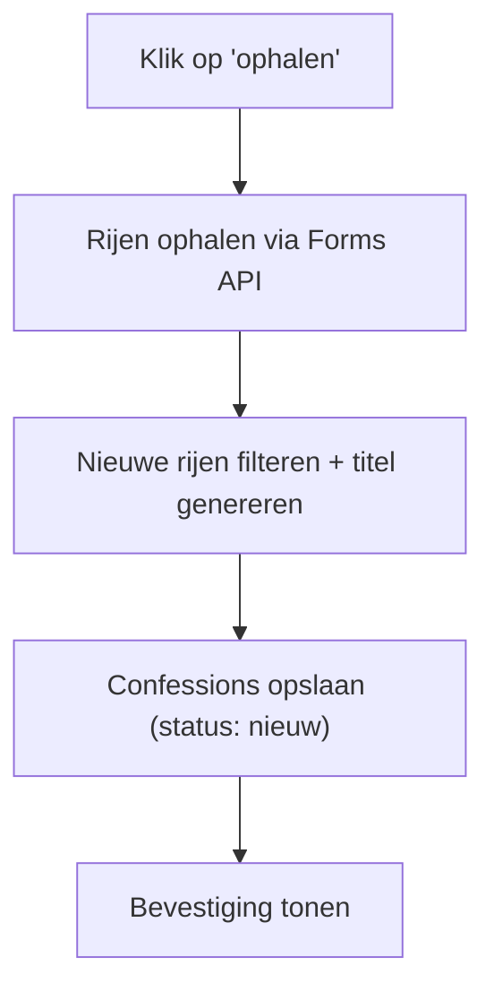
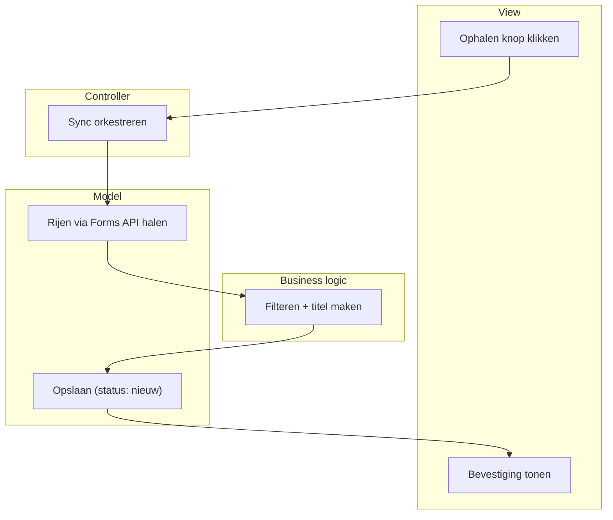

# KU Leuven Confessions — moderatie- en publicatietool

Een tool om de admin van de Instagram-pagina "KU Leuven Confessions" te helpen bij het filteren, categoriseren en publiceren van binnenkomende confessions. Gebouwd in Rust, als webapp, zelf gehost.

Dit document bevat het volledige High Level Design (HLD), opgebouwd volgens de **Application Structure Analysis (ASA)**-methodiek.

**Status:** ontwerp (stap 1 t/m 6) afgerond — implementatie nog te starten.

---

## Stap 1 — Probleemanalyse

**Probleem:** de admin krijgt een groot, ongestructureerd volume confessions binnen via een Google Form. Filteren, categoriseren en manueel in de Instagram-template plaatsen is trager en foutgevoeliger dan nodig.

**Doel:** confessions centraal verzamelen, laten taggen/categoriseren (manueel en later automatisch), filterbaar maken, en de admin volledige controle geven over categorieën/tags/template zonder dat hij moet kunnen programmeren.

**Stakeholders**
- **Admin** — enige primaire gebruiker
- **Ontwikkelaar** (ik) — bouwt en onderhoudt het systeem, tweede gebruiker
- *(indirect)* inzenders via het Google Form — leveren ruwe data, geen interactie met de tool

**Randvoorwaarden (niet-functionele eisen)**
- Eén à twee gebruikers, geen complexe rolverdeling nodig
- **Webapp**, zelf gehost op een oude MacBook, bereikbaar via een gratis Cloudflare Tunnel 
- Eén gedeeld wachtwoord ter beveiliging (de app is publiek bereikbaar via het internet)
- **Databron:** rechtstreeks de Google Forms API (read-only service-account), met CSV-import als terugvalplan
- **Backup:** dagelijkse kopie van de databank naar een gratis Google Drive-map op een apart, project-specifiek Google-account
- Gebouwd in **Rust** 
- Volledig **configureerbaar**: tags, categorieën en template-vormgeving door de admin zelf aanpasbaar, zonder code te wijzigen
- **Uitbreidbaar**: -latere automatische classificatie (LLM) en automatische Instagram-statistieken (Meta Graph API) moeten erbij kunnen zonder herbouw.
-Similarity search met qdrant om eventuele in te kunnen schatten hoe goed een post het gaat doen. 

---

## Stap 2 — Functionele decompositie (processen)

1. **Nieuwe confessions synchroniseren** — ophalen via de Forms API, dedupliceren op `form_response_id`, automatische titel genereren
2. **Confessions bekijken & filteren** — op status, tag, lengte, sortering (o.a. op likes)
3. **Confession taggen/categoriseren**
4. **Tag/categorie beheren** — aanmaken, hernoemen, kleur geven
5. **Confession verwijderen** — content wissen, tombstone-record behouden (zie onder)
6. **Confession markeren als 'gebruikt'** — volgnummer toekennen
7. **Confessie-afbeelding(en) + caption genereren** — template invullen, splitsen over meerdere afbeeldingen indien nodig, caption voorstellen
8. **Instellingen/configuratie beheren** — template, tekstlimieten, koppelingen, wachtwoord
9. **Periodieke backup wegschrijven** *(actor: timer, niet de admin)*
10. **Post-statistieken bijwerken** — like-/reactie-aantal koppelen (manueel nu, later automatisch via Meta Graph API)

---

## Stap 3 — ERD (datamodel)

**Belangrijke regels**
- `status` heeft drie waarden: `nieuw`, `gebruikt`, `verwijderd`.
- **Tombstone-pattern**: "verwijderen" wist de inhoud (tekst, privébericht, foto's, tags) maar behoudt het rijtje zelf (`id` + `form_response_id` + `status = verwijderd`). Dit voorkomt dat een verwijderde confession bij de volgende sync terug binnenkomt als "nieuw".
- `admin_message` (het privébericht aan de admin) mag **nooit** in de gegenereerde afbeelding of caption terechtkomen.
- `Tag` is generiek en dekt categorie, type én kwaliteit (bv. "meme", "zoekertje", "all stars") — geen apart veld per concept, alles via tags.
- Opslagbeleid voor foto's: bij `verwijderd` worden gekoppelde bestanden meteen opgeruimd; bij `gebruikt` blijven ze bewaard (nodig voor latere "all stars"-overzichten).

---

## Stap 4 — Schermschetsen

**Overzicht** — hoofdscherm: zoekbalk, sync-knop, filters (status/tag/sortering), lijst van confessions met titel, preview, tags en status.

**Confessie-detail** — volledige tekst, apart gemarkeerd privébericht aan de admin, tags toewijzen, acties (verwijderen / markeren als gebruikt / genereren). Bij gepubliceerde confessions: extra blok met Instagram-link en statistieken. Na genereren: voorbeeld van de afbeelding(en) + voorgestelde caption, met downloadknoppen.

**Instellingen** — drie tabbladen: *Tags & categorieën*, *Template* (lettertype, kleuren, tekstlimiet per afbeelding), *Algemeen* (API-koppeling, backup-map, wachtwoord, startnummer).

---

## Stap 5 — Flowcharts (happy path per proces)

Voorbeeld, proces "nieuwe confessions synchroniseren":

De overige processen volgen hetzelfde patroon: actor-trigger → data ophalen/bewerken → opslaan → resultaat tonen. Per proces:

| Proces | Happy path |
|---|---|
| Bekijken & filteren | Scherm openen → filters toepassen → lijst tonen |
| Taggen | Confession openen → tag kiezen → koppeling opslaan |
| Tag beheren | Instellingen openen → naam/kleur invoeren → tag opslaan |
| Verwijderen | 'Verwijderen' klikken → inhoud wissen, tombstone behouden → confession verdwijnt uit lijst |
| Markeren als gebruikt | Knop klikken → volgnummer toekennen → status bijwerken |
| Afbeelding(en) + caption genereren | 'Genereer' klikken → template invullen, eventueel splitsen → caption opstellen → resultaat tonen |
| Instellingen beheren | Parameter aanpassen → opslaan → direct van toepassing |
| Backup wegschrijven | Timer activeert → kopie maken → naar Drive sturen → tijdstip noteren |
| Statistieken bijwerken | Aantal invullen → opslaan met tijdstip |

---

## Stap 6 — ASD (Application Structure Diagram)

4 lagen: **Actor/View** (trigger) → **Controller** (orkestreert) → **Business logic** (regels) → **Model** (lezen/schrijven van data). Eén proces kan een laag meerdere keren bezoeken.

Voorbeeld, "nieuwe confessions synchroniseren":

Overzicht van alle processen:

| Proces | View | Controller | Business logic | Model |
|---|---|---|---|---|
| Synchroniseren | Ophalen klikken | Sync orkestreren | Filteren + titel maken | Forms API lezen + confession schrijven |
| Bekijken & filteren | Filters instellen | Verzoek verwerken | Filters/sortering toepassen | Confessions + tags ophalen |
| Taggen | Tag kiezen | Toewijzing verwerken | Check op duplicaat | ConfessionTag opslaan |
| Tag beheren | Nieuwe tag invoeren | Aanmaak verwerken | Naam-validatie | Tag opslaan |
| Verwijderen | 'Verwijderen' klikken | Verzoek verwerken | Inhoud wissen, tombstone behouden | Confession + bijlagen bijwerken |
| Markeren als gebruikt | Knop klikken | Verzoek verwerken | Volgend nummer bepalen | Confession bijwerken |
| Afbeelding(en) + caption genereren | 'Genereer' klikken | Verzoek verwerken | Tekst verdelen, caption opstellen | Template ophalen + afbeeldingen opslaan |
| Instellingen beheren | Parameter aanpassen | Wijziging verwerken | Waarde valideren | Setting/Template bijwerken |
| Backup wegschrijven | *(timer)* | Backup-taak starten | Bepalen wat wordt meegenomen | Kopie naar Drive + tijdstip |
| Statistieken bijwerken | Aantal invullen | Update verwerken | *(later: via Meta API)* | Confession bijwerken |

---

## Tech stack

- **Taal:** Rust
- **Web:** axum (server), server-side templates
- **Databank:** SQLite (lokaal bestand op de Mac)
- **Externe data:** Google Forms API, service-account met `forms.responses.readonly`-scope
- **Afbeeldingen:** SVG-template + `resvg` crate (rasterizen naar PNG)
- **Hosting:** oude Intel MacBook + Cloudflare Tunnel
- **Backup:** Google Drive, apart project-account

## Beveiliging

- Eén gedeeld wachtwoord voor toegang tot de webapp
- Service-account sleutel (`.json`) **nooit** in git committen — zie `.gitignore`
- Service-account heeft enkel leesrechten (`readonly`-scope), geen schrijf/verwijderrechten op het Form

## Volgende stappen

1. Rust-projectstructuur opzetten (`cargo new`)
2. Eerste testverbinding met de Google Forms API (bewijs dat de service-account-toegang ook in Rust werkt)
3. Databank-laag (SQLite + ERD hierboven)
4. Eerste webpagina (Overzicht-scherm)
5. Verder uitbouwen per proces, volgens de ASD hierboven