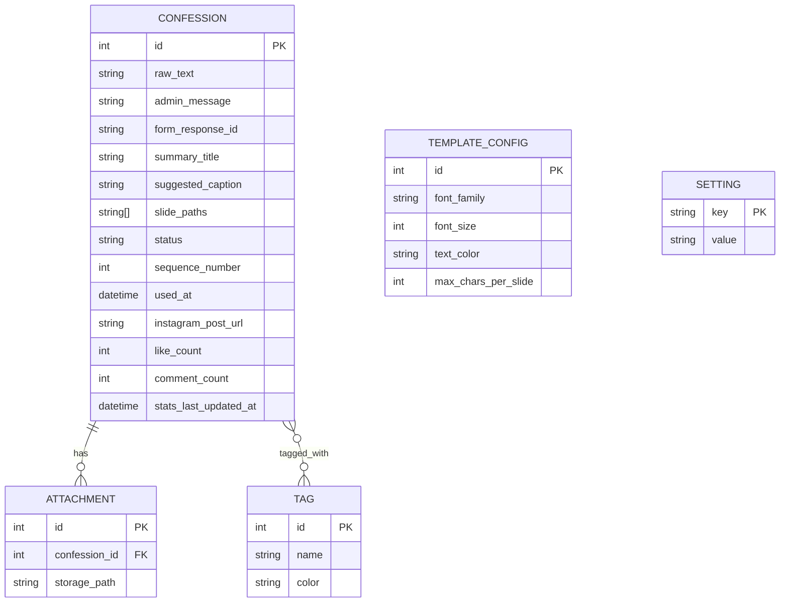
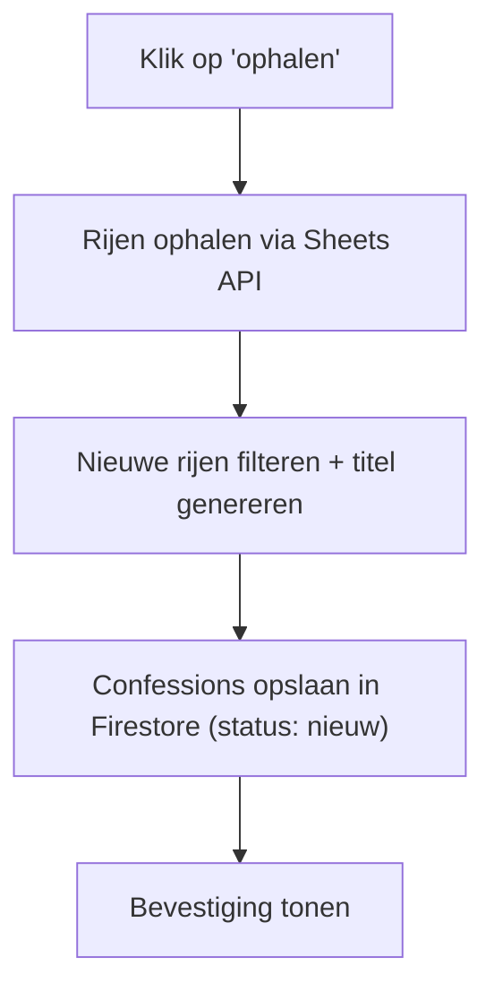
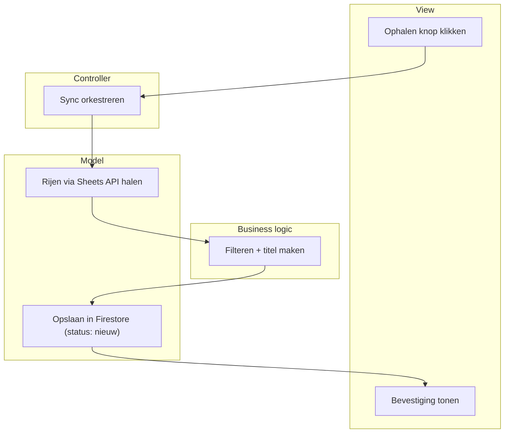

# KU Leuven Confessions — moderatie- en publicatietool

Een tool om de admin van de Instagram-pagina "KU Leuven Confessions" te helpen bij het filteren, categoriseren en publiceren van binnenkomende confessions.

**Architectuur:** een Rust API-server (backend, op Cloud Run) + een React-gebruikersinterface (frontend, op Firebase Hosting, opgebouwd volgens Atomic Design), die met elkaar praten via JSON-verzoeken. Data en bestanden leven in Firebase.

**Status:** ontwerp afgerond, implementatie gestart.

---

## Probleemanalyse

**Probleem:** de admin krijgt een groot, ongestructureerd volume confessions binnen via een Google Form. Filteren, categoriseren en manueel in de Instagram-template plaatsen is trager en foutgevoeliger dan nodig.

**Doel:** confessions centraal verzamelen, laten taggen/categoriseren (manueel en later automatisch), filterbaar maken, en de admin volledige controle geven over categorieën/tags/template zonder dat hij moet kunnen programmeren.

**Stakeholders**
- **Admin** — enige primaire gebruiker
- **Ontwikkelaar** — bouwt en onderhoudt het systeem, tweede gebruiker
- *(indirect)* inzenders via het Google Form — leveren ruwe data, geen interactie met de tool

**Randvoorwaarden (niet-functionele eisen)**
- Eén à twee gebruikers, geen complexe rolverdeling nodig
- **Backend:** Rust (axum), als container gehost op **Cloud Run** (serverless, schaalt naar nul bij geen gebruik)
- **Frontend:** React, opgebouwd volgens **Atomic Design** (atomen → moleculen → organismen → templates → pagina's), gescaffold met de `atomic-bomb`-tool, statisch gehost via **Firebase Hosting**
- Toegang via Google Identity-Aware Proxy, enkel toegestane Google-accounts (geen gedeeld wachtwoord)
- **Databron:** de Google Sheet gekoppeld aan het Form, gelezen via de Google Sheets API met een read-only service-account
- **Opslag tekstdata:** Firestore (Firebase)
- **Opslag afbeeldingen:** Cloud Storage for Firebase
- **Opruimbeleid afbeeldingen:** een confessie-afbeelding wordt een instelbaar aantal dagen na publicatie automatisch verwijderd — de Instagram-post zelf blijft het permanente archief, wij hoeven geen eigen kopie voor altijd te bewaren
- Volledig **configureerbaar**: tags, categorieën, template-vormgeving en opruimtermijn door de admin zelf aanpasbaar, zonder code te wijzigen
- **Uitbreidbaar**: latere automatische classificatie (LLM) en automatische Instagram-statistieken (Meta Graph API) moeten erbij kunnen zonder herbouw

---

## Kostenbeheer

Cloud Run en Cloud Storage for Firebase vereisen een betaalplan (Blaze) met een gekoppelde kaart, ook al blijft het verwachte verbruik ruim binnen het gratis quotum. Om verrassingen uit te sluiten:

- **Budget-alert** ingesteld op een laag bedrag (bv. €2), als vroege waarschuwing. Google stuurt hierbij automatisch een e-mail naar de billing-account-beheerders bij elke drempel (50/90/100%) — dit werkt out-of-the-box, zonder extra opzet.
- **Killswitch = native Spend Cap budgets** (Google Cloud, preview sinds juli 2026) op **Cloud Run** en **Cloud Run functions**, elk op €0,01. Zodra de geschatte brutokost de cap bereikt, blokkeert Google Cloud zelf automatisch nieuwe requests naar die dienst (near-realtime, binnen enkele minuten) — lopende requests maken nog af, en de cap moet manueel terug opgeheven worden in de Console. Geen eigen Cloud Function, Pub/Sub-topic of IAM-opzet nodig.
- **Belangrijke beperking:** spend caps dekken op dit moment enkel Gemini API, Agent Platform, Cloud Run en Cloud Run functions — **niet Firestore of Cloud Storage** (issues #6/#28). Voor die diensten blijft enkel de budget-alert e-mail als vroege waarschuwing; overschrijding daar vraagt een manuele reactie (betaalkoppeling loskoppelen via Cloud Console).
- Realistisch verbruik (1-2 gebruikers, occasioneel) blijft ordes van grootte onder het gratis quotum van Cloud Run (2 miljoen verzoeken/maand, 180.000 vCPU-seconden/maand). Het reële risico — een bug die ongemerkt continu blijft draaien — wordt voor Cloud Run zelf dus automatisch afgevangen; voor Firestore/Storage blijft het bij waakzaamheid op de budget-mail.

---

## Functionele decompositie (processen)

1. **Nieuwe confessions synchroniseren** — ophalen via de Sheets API, dedupliceren op `form_response_id`, automatische titel genereren
2. **Confessions bekijken & filteren** — op status, tag, lengte, sortering (o.a. op likes). Verwijderde confessions worden **standaard niet getoond**; een apart filter ("Prullenmand") laat ze tijdelijk zien
3. **Confession taggen/categoriseren**
4. **Tag/categorie beheren** — aanmaken, hernoemen, kleur geven
5. **Confession verwijderen** — content wissen, tombstone-record behouden, verdwijnt uit de standaardlijst (zie ERD-regels)
6. **Confession markeren als 'gebruikt'** — volgnummer toekennen
7. **Confessie-afbeelding(en) + caption genereren** — template invullen, tekst verdelen over meerdere afbeeldingen **met behoud van de originele alinea-structuur** (een witregel in de tekst is een natuurlijk splitspunt, geen botte afkap op tekenlimiet), caption voorstellen
8. **Instellingen/configuratie beheren** — template, tekstlimieten, opruimtermijn afbeeldingen, koppelingen
9. **Post-statistieken bijwerken** — like-/reactie-aantal koppelen (manueel nu, later automatisch via Meta Graph API)

---

## Datamodel (ERD)


```mermaid
erDiagram
  CONFESSION ||--o{ ATTACHMENT : has
  CONFESSION }o--o{ TAG : tagged_with
  CONFESSION {
    int id PK
    string raw_text
    string admin_message
    string form_response_id
    string summary_title
    string suggested_caption
    string[] slide_paths
    string status
    int sequence_number
    datetime used_at
    string instagram_post_url
    int like_count
    int comment_count
    datetime stats_last_updated_at
  }
  ATTACHMENT {
    int id PK
    int confession_id FK
    string storage_path
  }
  TAG {
    int id PK
    string name
    string color
  }
  TEMPLATE_CONFIG {
    int id PK
    string font_family
    int font_size
    string text_color
    int max_chars_per_slide
  }
  SETTING {
    string key PK
    string value
  }
```

**Belangrijke regels**
- `status` heeft drie waarden: `nieuw`, `gebruikt`, `verwijderd`.
- **Tombstone-pattern**: "verwijderen" wist de inhoud (tekst, privébericht, foto's, tags) maar behoudt het rijtje zelf (`id` + `form_response_id` + `status = verwijderd`). Dit voorkomt dat een verwijderde confession bij de volgende sync terug binnenkomt als "nieuw" — en omdat het Overzicht standaard op status filtert, valt hij ook gewoon uit de normale lijst.
- `admin_message` (het privébericht aan de admin) mag **nooit** in de gegenereerde afbeelding of caption terechtkomen.
- `Tag` is generiek en dekt categorie, type én kwaliteit (bv. "meme", "zoekertje", "all stars").
- **Firestore-vertaling**: `Confession` wordt een document in een `confessions`-collectie met een `tagIds`-array erin. Slide-afbeeldingen worden **niet** als aparte subcollectie bewaard (bewust vereenvoudigd bij issue #29: slides worden altijd samen met hun confession gelezen/geschreven, nooit individueel) — hun paden staan gewoon als een geordende `slide_paths`-array op de Confession zelf, index = slide-nummer. `Attachment` (issue #38b) is nog wel gepland als subcollectie, want dat is een aparte, nog te ontwerpen beslissing.

---

## Schermschetsen

**Overzicht** — hoofdscherm: zoekbalk, sync-knop, filters (status/tag/sortering, incl. "Prullenmand"-filter voor verwijderde confessions), lijst van confessions met titel, preview, tags en status.

**Confessie-detail** — volledige tekst, apart gemarkeerd privébericht aan de admin, tags toewijzen, acties (verwijderen / markeren als gebruikt / genereren). Bij gepubliceerde confessions: extra blok met Instagram-link en statistieken. Na genereren: voorbeeld van de afbeelding(en) + voorgestelde caption, met downloadknoppen.

**Instellingen** — drie tabbladen: *Tags & categorieën*, *Template* (lettertype, kleuren, tekstlimiet per afbeelding), *Algemeen* (API-koppeling, opruimtermijn afbeeldingen, startnummer). Geen wachtwoord-instelling meer — toegang loopt via Identity-Aware Proxy (zie "Beveiliging").

---

## Procesflows (happy path)

Voorbeeld, proces "nieuwe confessions synchroniseren":


```mermaid
flowchart TD
    A[Klik op 'ophalen'] --> B[Rijen ophalen via Sheets API]
    B --> C[Nieuwe rijen filteren + titel genereren]
    C --> D["Confessions opslaan in Firestore (status: nieuw)"]
    D --> E[Bevestiging tonen]
```

| Proces | Happy path |
|---|---|
| Bekijken & filteren | Scherm openen → filters toepassen (incl. Prullenmand) → lijst tonen |
| Taggen | Confession openen → tag kiezen → koppeling opslaan |
| Tag beheren | Instellingen openen → naam/kleur invoeren → tag opslaan |
| Verwijderen | 'Verwijderen' klikken → inhoud wissen, tombstone behouden → confession verdwijnt uit standaardlijst |
| Markeren als gebruikt | Knop klikken → volgnummer toekennen → status bijwerken |
| Afbeelding(en) + caption genereren | 'Genereer' klikken → template invullen, splitsen op alinea's → caption opstellen → resultaat tonen |
| Instellingen beheren | Parameter aanpassen → opslaan → direct van toepassing |
| Statistieken bijwerken | Aantal invullen → opslaan met tijdstip |

---

## Architectuur (ASD)

4 lagen: **Actor/View** (React-frontend) → **Controller** (Rust route-handler) → **Business logic** (regels) → **Model** (Sheets API / Firestore / Cloud Storage).


```mermaid
flowchart TD
    subgraph View
        A1[Ophalen knop klikken]
        A2[Bevestiging tonen]
    end
    subgraph Controller
        B1[Sync orkestreren]
    end
    subgraph BusinessLogic["Business logic"]
        C1[Filteren + titel maken]
    end
    subgraph Model
        D1[Rijen via Sheets API halen]
        D2["Opslaan in Firestore (status: nieuw)"]
    end
    A1 --> B1 --> D1 --> C1 --> D2 --> A2
```

| Proces | View | Controller | Business logic | Model |
|---|---|---|---|---|
| Synchroniseren | Ophalen klikken | Sync orkestreren | Filteren + titel maken | Sheets API lezen + Firestore schrijven |
| Bekijken & filteren | Filters instellen | Verzoek verwerken | Filters/sortering toepassen | Confessions + tags ophalen |
| Taggen | Tag kiezen | Toewijzing verwerken | Check op duplicaat | `tagIds` bijwerken |
| Tag beheren | Nieuwe tag invoeren | Aanmaak verwerken | Naam-validatie | Tag-document opslaan |
| Verwijderen | 'Verwijderen' klikken | Verzoek verwerken | Inhoud wissen, tombstone behouden | Confession-document bijwerken |
| Markeren als gebruikt | Knop klikken | Verzoek verwerken | Volgend nummer bepalen | Confession bijwerken |
| Afbeelding(en) + caption genereren | 'Genereer' klikken | Verzoek verwerken | Tekst verdelen op alinea's, caption opstellen | Template ophalen + afbeeldingen naar Cloud Storage |
| Instellingen beheren | Parameter aanpassen | Wijziging verwerken | Waarde valideren | Setting bijwerken |
| Statistieken bijwerken | Aantal invullen | Update verwerken | *(later: via Meta API)* | Confession bijwerken |

---

## Projectstructuur

```
kuleuven-confessions-tool/
├── README.md
├── .gitignore
├── secrets/                     # NOOIT in git — service-account.json
├── backend/                     # Rust API-server (Cloud Run-container)
│   ├── Cargo.toml
│   ├── Dockerfile
│   ├── templates/
│   │   └── confession-template.svg   # SVG-sjabloon voor confession-afbeeldingen
│   └── src/
│       ├── main.rs              # opstarten server + routes registreren
│       ├── config.rs            # instellingen/omgevingsvariabelen inladen
│       ├── routes/              # Controller-laag: 1 HTTP-handler per resource
│       │   ├── mod.rs
│       │   ├── confessions.rs
│       │   ├── tags.rs
│       │   ├── settings.rs
│       │   └── sync.rs
│       ├── business/            # Business logic-laag: regels & validatie
│       │   ├── mod.rs
│       │   ├── dedupe.rs        # tombstone-check bij sync
│       │   ├── title.rs         # automatische titel genereren
│       │   ├── template.rs      # tekst verdelen op alinea's + caption opstellen
│       │   └── numbering.rs     # volgnummer toekennen
│       └── model/               # Model-laag: lezen/schrijven van data
│           ├── mod.rs
│           ├── sheets.rs        # Google Sheets API (nieuwe confessions ophalen)
│           ├── firestore.rs     # Firestore (confessions/tags/settings CRUD)
│           ├── storage.rs       # Cloud Storage for Firebase (afbeeldingen op-/downloaden/opruimen)
│           └── image_render.rs  # resvg: SVG-template → PNG
└── frontend/                    # React, Atomic Design (build meegeleverd in de backend-image)
    ├── package.json
    ├── .atomic-bomb             # config voor de atomic-bomb generator
    └── src/
        ├── components/
        │   ├── atoms/           # bv. Button, Label, Input
        │   ├── molecules/       # bv. TagChip, SearchBar
        │   ├── organisms/       # bv. ConfessionCard, FilterBar
        │   ├── templates/       # paginalay-outs zonder echte data
        │   └── pages/           # Overzicht, Detail, Instellingen
        └── api/
            ├── client.ts        # gedeelde fetch-helper (basis-URL, IAP-sessiecookie, errors)
            └── confessions.ts   # fetch-aanroepen naar de Rust-backend (Cloud Run-URL)
```

---

## Tech stack

- **Backend:** Rust, axum (webserver), gecontaineriseerd, gehost op Cloud Run
- **Frontend:** React + TypeScript (Vite), Atomic Design via `atomic-bomb` — build wordt geserveerd
  door de backend zelf (`tower-http`, statische bestanden), zelfde Cloud Run-service/origin als de
  API. Bewuste keuze i.p.v. een aparte host (bv. Firebase Hosting): zo werkt Identity-Aware Proxy
  (zie "Beveiliging") met één sign-in-gate voor zowel de pagina als de API-calls die de pagina doet -
  cross-origin zou daar niet betrouwbaar mee werken.
- **Databank:** Firestore (Firebase)
- **Bestandsopslag:** Cloud Storage for Firebase (afbeeldingen, met automatisch opruimbeleid)
- **Externe data:** Google Sheets API, service-account met `spreadsheets.readonly`-scope
- **Afbeeldingen genereren:** SVG-template + `resvg` crate (rasterizen naar PNG)
- **Kostenbeveiliging:** budget-alert + automatische killswitch (zie 'Kostenbeheer')

## Beveiliging

- Toegang tot de webapp via Google **Identity-Aware Proxy** — enkel toegestane Google-accounts
  kunnen ermee inloggen, geen gedeeld wachtwoord (zie issue #31 in ISSUES.md voor de afweging).
  Werkt omdat frontend en API op hetzelfde origin draaien (zie "Tech stack"): één sign-in op de
  pagina, de sessiecookie dekt daarna ook de `fetch()`-calls van diezelfde pagina.
- Service-account sleutel (`.json`) **nooit** in git committen — zie `.gitignore`
- Service-account heeft enkel leesrechten, geen schrijf/verwijderrechten op de Sheet
- Het Sheet-ID zelf is geen geheim en mag gedeeld worden; de sleutel (`private_key`) wél altijd geheim houden
- **Least privilege**: `kul-confessions@` stond tijdelijk op Owner (nodig om alles te activeren), nu teruggebracht tot enkel `roles/datastore.user` op projectniveau, plus `roles/storage.objectAdmin` (enkel op de eigen bucket) en `roles/run.invoker` (enkel op `confessor-backend`) — allebei al eerder resource-specifiek toegekend. Sheets/Drive-toegang loopt sowieso niet via IAM maar via het delen van de Sheet/map zelf. Geverifieerd tegen de live Cloud Run-service: Firestore, Storage, cleanup en Sheets-sync werken allemaal nog correct met deze beperkte rechten.

## Deployment

- **Service:** `confessor-backend`, Cloud Run, regio `europe-west1` (zelfde regio als Firestore) —
  serveert zowel de API als de gebouwde frontend (één origin, zie "Tech stack")
- **Herdeployen:** `backend/deploy.sh [tag]` — bouwt de image (linux/amd64, ook vanaf Apple Silicon), pusht naar Artifact Registry, deployt naar Cloud Run.
  **Nog te doen:** de Dockerfile bouwt momenteel enkel de Rust-binary; moet uitgebreid worden met
  een `npm run build`-stap voor `frontend/` en die `dist/`-map meekopiëren, zodat de backend hem
  effectief kan serveren.
- **Toegang:** `--no-allow-unauthenticated` (IAM-gated) — blijft zo. Wordt **niet** naar
  `--allow-unauthenticated` gezet: toegang loopt via Identity-Aware Proxy vóór de service, met een
  lijst toegestane Google-accounts (issue #31), niet via een publiek-open API.
- **Auth:** de service draait onder het bestaande `kul-confessions@`-service-account (ADC via Cloud Run's gekoppelde identiteit, zie issue #9 — geen sleutelbestand in de container)

## Status & volgende stappen

- [x] Ontwerp (datamodel, schermen, procesflows, architectuur)
- [x] Projectstructuur opgezet (backend + frontend monorepo)
- [x] Sheet gedeeld met het service-account (Viewer-rol)
- [x] Sheets-API-code + Firestore-client + eerste verticale pad (sync → dedupe → titel → opslaan)
- [x] Firebase-project aangemaakt, Firestore ingeschakeld
- [x] Budget-alert + killswitch (native Spend Cap budgets) + overstap naar Blaze
- [x] Cloud Storage for Firebase ingeschakeld (no-cost region, US-EAST1)
- [x] Config gecentraliseerd, ADC-auth i.p.v. hardcoded sleutelbestand
- [x] Dockerfile + Cloud Run-deployment, getest vanaf laptop (IAM-gated)
- [x] Backend: bekijken/filteren, taggen, verwijderen, markeren-als-gebruikt, instellingen-CRUD
- [x] Afbeelding-rendering (SVG → PNG), tekst-verdeling over slides
- [ ] Afbeelding-upload naar Cloud Storage + genereer-endpoint (issues #28-29)
- [ ] Meme/afbeelding van Drive ophalen (issue #38b)
- [ ] Like/comment-statistieken bijwerken (issue #30)
- [x] Frontend-foundation: fetch-wrappers naar de backend (`api/confessions.ts`), app-shell
- [ ] Frontend als static files serveren via `tower-http` in dezelfde Cloud Run-service (nodig vóór IAP zinvol is)
- [ ] Identity-Aware Proxy inschakelen + toegestane Google-accounts toevoegen (issue #31, GCP Console)
- [ ] Frontend (overzicht, detail, instellingen) — issues #33-#38